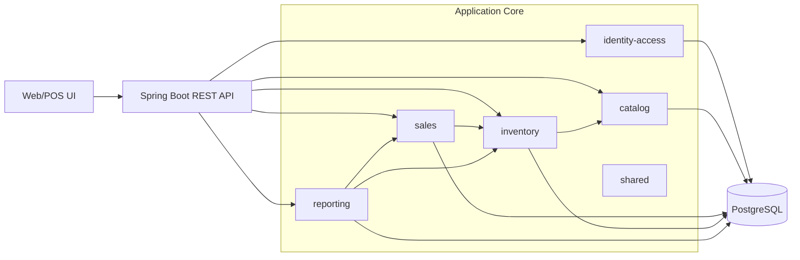
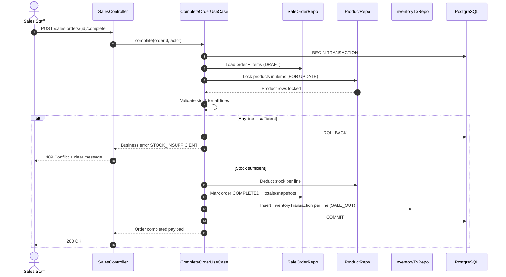

# Architecture - Simple Sales & Inventory Management (MVP)

## 1. Purpose and Scope

This architecture defines how to implement the MVP requirements from PRD v1.1 and epics with a production-friendly, maintainable design.

- In scope: single-store backend APIs, stock-safe sales completion, stock-in and adjustments, reporting, RBAC, auditability.
- Out of scope: multi-store, barcode integration, advanced costing (FIFO/moving average), backend print queue.

## 2. Technology Stack

- Backend: `Spring Boot 3.x` (`Java 21`)
- Architecture style: `Clean Architecture` with enterprise layered boundaries
- Data access: `Spring Data JPA` + `Hibernate`
- Database: `PostgreSQL 15+`
- Authentication: `Spring Security` + JWT bearer token
- Validation: `jakarta.validation` (Bean Validation)
- API docs: `springdoc-openapi` (OpenAPI 3)
- Observability: `Micrometer` + structured logging (JSON)
- Testing:
  - Unit: `JUnit 5`, `Mockito`
  - Integration: `SpringBootTest`, `Testcontainers PostgreSQL`

## 3. Architectural Principles

- Keep inventory consistency as first priority for all stock-changing flows.
- Use transaction boundaries at use-case level, not inside repositories.
- Keep domain rules explicit and testable (BR-01..BR-05).
- Favor deterministic, boring patterns for maintainability.
- Enforce RBAC at API + application service boundary.

## 4. Module Decomposition (by Epic)

### 4.1 High-Level Modules

- `identity-access`
  - Auth, token issuance/validation, user role enforcement (`ADMIN`, `SALES`)
- `catalog`
  - Product management, SKU uniqueness, product status lifecycle
- `sales`
  - Draft order lifecycle, discounting, completion, cancellation, invoice detail payload
- `inventory`
  - Stock-in confirmation, stock adjustment, inventory transaction logging
- `reporting`
  - Revenue, gross profit, top-selling, low-stock reporting
- `shared`
  - Error model, API response envelope, pagination, common enums, clock/id providers

### 4.2 Clean Architecture Layers

- `api` (controllers, request/response DTOs, security annotations)
- `application` (use cases, command/query handlers, transaction orchestration)
- `domain` (entities, value objects, domain services, business exceptions)
- `infrastructure` (JPA entities/repositories, mappers, external adapters)

## 5. Module Diagram



## 6. Concurrency and Transaction Strategy (Story 2.3 Critical)

### 6.1 Selected Strategy

For `Complete Sale Order` (Story 2.3), use:

- **Pessimistic row locking** on `products` rows via `SELECT ... FOR UPDATE`
- Single DB transaction (`READ COMMITTED` is acceptable with explicit row locks)
- Fail-fast validation for any insufficient stock line
- Atomic commit/rollback for order status + stock deductions + inventory transactions

### 6.2 Why Pessimistic Locking Here

- Prevents race condition when multiple cashiers complete overlapping product orders simultaneously.
- Simple operational behavior for MVP load (<=10 concurrent users).
- Reduces complexity compared to optimistic retry loops for checkout flow.

### 6.3 Additional Safeguards

- Add `version` column on `products` for optimistic control in non-critical updates (catalog edits).
- Add idempotency key for `POST /sales-orders/{id}/complete` to prevent duplicate completion on network retries.
- Enforce `stock_qty >= 0` check in application logic and DB constraints.

## 7. Sequence Diagram - Story 2.3 Complete Order with Atomic Stock Deduction



## 8. Data Model and PostgreSQL DDL (Sample)

Note: DDL below is MVP baseline and can be extended for partitioning/archival later.

```sql
create extension if not exists "pgcrypto";

create table users (
  id uuid primary key default gen_random_uuid(),
  full_name varchar(120) not null,
  username varchar(80) not null unique,
  role varchar(20) not null check (role in ('ADMIN', 'SALES')),
  status varchar(20) not null check (status in ('ACTIVE', 'INACTIVE')),
  created_at timestamptz not null default now(),
  updated_at timestamptz not null default now()
);

create table products (
  id uuid primary key default gen_random_uuid(),
  sku varchar(64) not null unique,
  name varchar(200) not null,
  unit varchar(40) not null,
  selling_price numeric(18,2) not null check (selling_price >= 0),
  purchase_price numeric(18,2) not null check (purchase_price >= 0),
  stock_qty numeric(18,3) not null check (stock_qty >= 0),
  low_stock_threshold numeric(18,3) not null check (low_stock_threshold >= 0),
  status varchar(20) not null check (status in ('ACTIVE', 'INACTIVE')),
  version bigint not null default 0,
  created_at timestamptz not null default now(),
  updated_at timestamptz not null default now()
);

create table sale_orders (
  id uuid primary key default gen_random_uuid(),
  order_no varchar(40) not null unique,
  status varchar(20) not null check (status in ('DRAFT', 'COMPLETED', 'CANCELED')),
  subtotal numeric(18,2) not null default 0 check (subtotal >= 0),
  discount_type varchar(20) null check (discount_type in ('PERCENT', 'FIXED')),
  discount_value numeric(18,2) null check (discount_value >= 0),
  discount_amount numeric(18,2) not null default 0 check (discount_amount >= 0),
  total numeric(18,2) not null default 0 check (total >= 0),
  created_by uuid not null references users(id),
  completed_at timestamptz null,
  canceled_at timestamptz null,
  created_at timestamptz not null default now(),
  updated_at timestamptz not null default now()
);

create table sale_order_items (
  id uuid primary key default gen_random_uuid(),
  sale_order_id uuid not null references sale_orders(id) on delete cascade,
  product_id uuid not null references products(id),
  sku_snapshot varchar(64) not null,
  product_name_snapshot varchar(200) not null,
  qty numeric(18,3) not null check (qty > 0),
  unit_price numeric(18,2) not null check (unit_price >= 0),
  purchase_price_snapshot numeric(18,2) null check (purchase_price_snapshot >= 0),
  line_total numeric(18,2) not null check (line_total >= 0)
);

create table stock_ins (
  id uuid primary key default gen_random_uuid(),
  reference_no varchar(40) not null unique,
  status varchar(20) not null check (status in ('DRAFT', 'CONFIRMED', 'CANCELED')),
  note text null,
  created_by uuid not null references users(id),
  confirmed_at timestamptz null,
  created_at timestamptz not null default now(),
  updated_at timestamptz not null default now()
);

create table stock_in_items (
  id uuid primary key default gen_random_uuid(),
  stock_in_id uuid not null references stock_ins(id) on delete cascade,
  product_id uuid not null references products(id),
  qty numeric(18,3) not null check (qty > 0),
  unit_cost numeric(18,2) null check (unit_cost >= 0)
);

create table stock_adjustments (
  id uuid primary key default gen_random_uuid(),
  product_id uuid not null references products(id),
  qty_delta numeric(18,3) not null check (qty_delta <> 0),
  reason varchar(255) not null,
  qty_before numeric(18,3) not null check (qty_before >= 0),
  qty_after numeric(18,3) not null check (qty_after >= 0),
  actor_user_id uuid not null references users(id),
  created_at timestamptz not null default now()
);

create table inventory_transactions (
  id uuid primary key default gen_random_uuid(),
  product_id uuid not null references products(id),
  transaction_type varchar(30) not null check (transaction_type in ('SALE_OUT', 'STOCK_IN', 'ADJUSTMENT', 'SALE_RESTORE')),
  qty_delta numeric(18,3) not null,
  qty_before numeric(18,3) not null check (qty_before >= 0),
  qty_after numeric(18,3) not null check (qty_after >= 0),
  reference_type varchar(30) not null check (reference_type in ('SALE_ORDER', 'STOCK_IN', 'ADJUSTMENT')),
  reference_id uuid not null,
  reason varchar(255) null,
  actor_user_id uuid not null references users(id),
  created_at timestamptz not null default now()
);

create table api_idempotency (
  id uuid primary key default gen_random_uuid(),
  idempotency_key varchar(100) not null unique,
  endpoint varchar(120) not null,
  actor_user_id uuid not null references users(id),
  request_hash varchar(128) not null,
  response_status int not null,
  response_body jsonb not null,
  created_at timestamptz not null default now()
);

create index ix_users_role_status on users(role, status);
create index ix_products_status on products(status);
create index ix_products_low_stock on products(status, stock_qty, low_stock_threshold);
create index ix_sale_orders_status_created_at on sale_orders(status, created_at desc);
create index ix_sale_orders_completed_at on sale_orders(completed_at desc);
create index ix_soi_sale_order_id on sale_order_items(sale_order_id);
create index ix_soi_product_id on sale_order_items(product_id);
create index ix_stock_ins_status_created_at on stock_ins(status, created_at desc);
create index ix_sii_stock_in_id on stock_in_items(stock_in_id);
create index ix_sii_product_id on stock_in_items(product_id);
create index ix_stock_adj_product_created_at on stock_adjustments(product_id, created_at desc);
create index ix_stock_adj_actor_created_at on stock_adjustments(actor_user_id, created_at desc);
create index ix_inv_tx_product_created_at on inventory_transactions(product_id, created_at desc);
create index ix_inv_tx_reference on inventory_transactions(reference_type, reference_id);
create index ix_inv_tx_type_created_at on inventory_transactions(transaction_type, created_at desc);
create index ix_inv_tx_created_at on inventory_transactions(created_at desc);
```

## 9. API Design

### 9.1 Core REST Endpoints

#### Identity / Access

- `POST /api/v1/auth/login`
- `GET /api/v1/me`

#### Catalog (Epic 1)

- `POST /api/v1/products`
- `PATCH /api/v1/products/{id}`
- `PATCH /api/v1/products/{id}/status`
- `GET /api/v1/products`
- `GET /api/v1/products/{id}`

#### Sales (Epic 2)

- `POST /api/v1/sales-orders`
- `GET /api/v1/sales-orders/{id}`
- `PATCH /api/v1/sales-orders/{id}/items`
- `PATCH /api/v1/sales-orders/{id}/discount`
- `POST /api/v1/sales-orders/{id}/complete`
- `POST /api/v1/sales-orders/{id}/cancel`
- `GET /api/v1/sales-orders/{id}/invoice-detail`

#### Inventory (Epic 3)

- `POST /api/v1/stock-ins`
- `GET /api/v1/stock-ins/{id}`
- `POST /api/v1/stock-ins/{id}/confirm`
- `POST /api/v1/stock-adjustments`
- `GET /api/v1/inventory-transactions`

#### Reporting (Epic 4)

- `GET /api/v1/reports/revenue-daily?from=yyyy-mm-dd&to=yyyy-mm-dd`
- `GET /api/v1/reports/gross-profit?from=yyyy-mm-dd&to=yyyy-mm-dd`
- `GET /api/v1/reports/top-selling?from=yyyy-mm-dd&to=yyyy-mm-dd&limit=10`
- `GET /api/v1/reports/low-stock`

## 10. API Response Schema and Error Contract

### 10.1 Success Envelope

```json
{
  "success": true,
  "data": {},
  "meta": {
    "timestamp": "2026-04-21T12:00:00Z",
    "requestId": "5f7c2f8e-0f5f-4ce9-9cfe-2fd49dc2f3a5"
  }
}
```

### 10.2 Error Envelope

```json
{
  "success": false,
  "error": {
    "code": "STOCK_INSUFFICIENT",
    "message": "Insufficient stock for one or more items.",
    "details": [
      {
        "field": "items[1].qty",
        "reason": "Requested 5.000 but available 2.000 for SKU SP-001"
      }
    ]
  },
  "meta": {
    "timestamp": "2026-04-21T12:00:00Z",
    "requestId": "5f7c2f8e-0f5f-4ce9-9cfe-2fd49dc2f3a5"
  }
}
```

### 10.3 Suggested HTTP Status Mapping

- `200 OK`: successful read/update action
- `201 Created`: successful create action
- `400 Bad Request`: malformed request/payload contract issue
- `401 Unauthorized`: missing/invalid auth token
- `403 Forbidden`: role does not have required permission
- `404 Not Found`: resource not found
- `409 Conflict`: business concurrency or state conflict (`STOCK_INSUFFICIENT`, `ORDER_NOT_DRAFT`, duplicate operation)
- `422 Unprocessable Entity`: validation failed with business-readable details
- `500 Internal Server Error`: unexpected server error

### 10.4 Standard Error Codes

- `AUTH_INVALID_CREDENTIALS`
- `AUTH_TOKEN_INVALID`
- `PERMISSION_DENIED`
- `PRODUCT_SKU_DUPLICATE`
- `PRODUCT_INACTIVE_NOT_SELLABLE`
- `ORDER_NOT_FOUND`
- `ORDER_NOT_DRAFT`
- `ORDER_ALREADY_COMPLETED`
- `STOCK_INSUFFICIENT`
- `STOCK_ADJUSTMENT_REASON_REQUIRED`
- `STOCK_IN_NOT_FOUND`
- `STOCK_IN_NOT_DRAFT`
- `REPORT_INVALID_DATE_RANGE`
- `VALIDATION_ERROR`
- `INTERNAL_ERROR`

## 11. Security and RBAC

- JWT-based stateless auth.
- Role matrix:
  - `ADMIN`: full access to catalog, inventory, reporting, sensitive operations
  - `SALES`: sales flow + allowed reads; no critical stock adjustment or destructive admin ops
- Apply method-level guards (e.g., `@PreAuthorize`) and endpoint-level policy checks.
- Mask sensitive internal exception traces from API responses.

## 12. Performance and NFR Alignment

- NFR target: P95 < 2s for core APIs at <=10 concurrent users.
- Query optimization via targeted indexes listed in DDL.
- Use projection queries for reports to avoid over-fetching entities.
- Enable pagination for listing/audit endpoints.
- Add timeout and retry policies only for non-transactional external integrations (future phase).

## 13. Observability and Auditability

- Log all inventory mutations with:
  - actor, reference, qty_before, qty_after, qty_delta, timestamp
- Propagate `requestId` across logs and API responses.
- Metrics:
  - order completion latency
  - stock conflict count
  - report query duration
  - API error rate by endpoint

## 14. Backup and Recovery (MVP)

- Daily PostgreSQL logical backup (`pg_dump`) with retention policy.
- Weekly restore dry-run in non-production environment.
- Document RTO/RPO target for operations (initial target: same-day restore).

## 15. Traceability Matrix (FR -> Modules)

- FR1 Product CRUD + low-stock threshold -> `catalog`
- FR2 Sales order + discount -> `sales`
- FR3 Atomic stock deduction/cancel restore -> `sales` + `inventory`
- FR4 Stock-in + latest purchase price update -> `inventory`
- FR5 Stock adjustment with reason/audit -> `inventory`
- FR6 Revenue/profit/top-sell/low-stock reports -> `reporting`
- FR7 RBAC Admin/Sales -> `identity-access`
- FR8 Invoice detail payload -> `sales`

## 16. Implementation Notes

- Prioritize Story 2.3 transaction safety before broad API expansion.
- Build integration tests for:
  - concurrent order completion on same SKU
  - rollback behavior on partial stock insufficiency
  - cancellation restore logic
- Keep future extensibility hooks for costing strategy upgrade.
